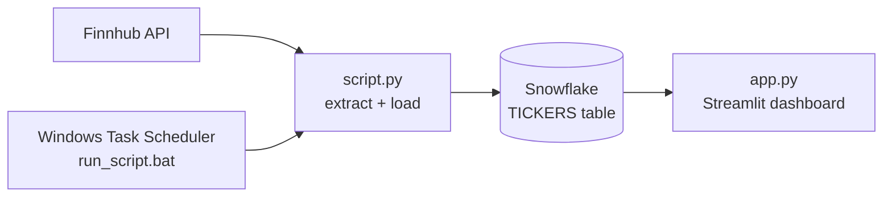

# stock-tickers-pipeline

Pipeline that pulls the list of US-listed tickers from the **Finnhub API**, loads it into **Snowflake**, and serves it through a **Streamlit** dashboard. Scheduled on Windows.

## Architecture



## What it does

- Fetches ~31k US tickers (symbol, description, type, currency, FIGI, MIC) from Finnhub.
- Loads them into a Snowflake table with a `LOADED_AT` timestamp.
- Dashboard: total tickers, last update time, search by symbol/description, breakdown by instrument type.

## Design decisions

- **Finnhub** as source, after moving off an earlier API with a very low rate limit.
- **Snowflake** as the warehouse.
- **Secrets in environment variables** (`.env` + `python-dotenv`), never committed.
- **Windows Task Scheduler** runs `run_script.bat`, which appends output to `log.txt`.

## Repository structure

```
script.py          # extract from Finnhub, load into Snowflake
app.py             # Streamlit dashboard
run_script.bat     # entry point for the scheduler
requirements.txt
.env.example
```

## Getting started

```bash
git clone https://github.com/ssilvestre95/stock-tickers-pipeline.git
cd stock-tickers-pipeline
python -m venv .venv
source .venv/bin/activate        # Windows: .venv\Scripts\activate
pip install -r requirements.txt
cp .env.example .env             # add your Finnhub key and Snowflake credentials
python script.py                 # load the data
streamlit run app.py             # open the dashboard
```

## Limitations

- Each run does `DROP TABLE` + `CREATE TABLE` + insert, so **no history is kept**, only the latest snapshot.
- US exchange only.
- No retries, tests or data-quality checks yet.

## Roadmap

- [ ] Keep history: append snapshots (or `MERGE`) instead of dropping the table
- [ ] Add data-quality checks and structured logging
- [ ] Extend to price data for the world's top 50 companies (including non-US)
- [ ] Move scheduling to an orchestrator (e.g. Kestra, from the Zoomcamp)
