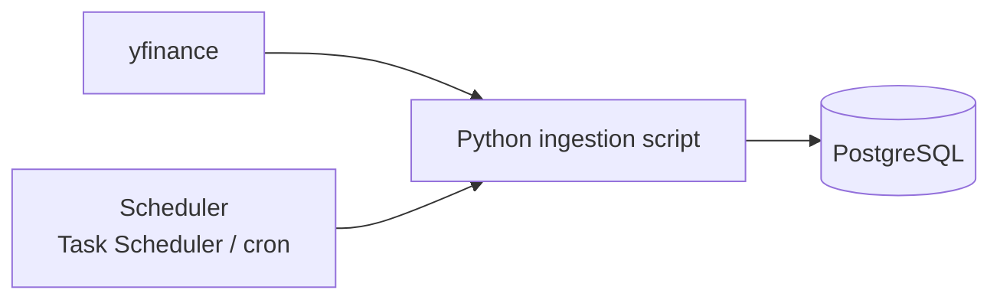

# global-top50-pipeline

Scheduled pipeline that tracks the price performance of the **50 largest listed companies in the world by market cap** (US and non-US) and stores the history in PostgreSQL.

> Educational project. Not financial advice.

## Architecture



## What it does

- Fetches price data for the top 50 companies by market cap, refreshed **every hour**.
- Loads it into PostgreSQL so performance can be queried with plain SQL.
- **TODO:** one line on how the top-50 list is built/updated (fixed list, or derived from market cap?).

## Design decisions

- **Data source: yfinance.** The project started with a free-tier API with a low rate limit, then moved to Finnhub. It ended up on yfinance because the goal is a *true* global top 50, including non-US stocks, rather than a US index like the Dow Jones.
- **PostgreSQL** as storage, so the data can be modelled and queried with SQL.
- **Scheduling:** Windows Task Scheduler (`schtasks`) during development.

## Data model

**TODO:** list the tables and key columns, for example:

| Table | Grain | Key columns |
|---|---|---|
| `TODO` | one row per ticker per timestamp | `TODO` |

## Getting started

```bash
git clone https://github.com/ssilvestre95/global-top50-pipeline.git
cd global-top50-pipeline
python -m venv .venv
source .venv/bin/activate        # Windows: .venv\Scripts\activate
pip install -r requirements.txt
cp .env.example .env             # fill in your PostgreSQL credentials
python TODO_main_script.py
```

### Scheduling (Windows example)

```powershell
schtasks /create /tn "top50-ingest" /tr "C:\path\to\.venv\Scripts\python.exe C:\path\to\TODO_main_script.py" /sc hourly
```

## Limitations

- yfinance is an unofficial wrapper: data can be delayed, incomplete or break without notice.
- No orchestration, retries or data-quality checks yet.

## Roadmap

- [ ] Add data-quality checks (missing tickers, stale prices)
- [ ] Add retries and logging
- [ ] Move scheduling to an orchestrator (e.g. Kestra, from the Zoomcamp)
- [ ] Build SQL views / a simple dashboard for performance vs. 1d / 1w / 1m
